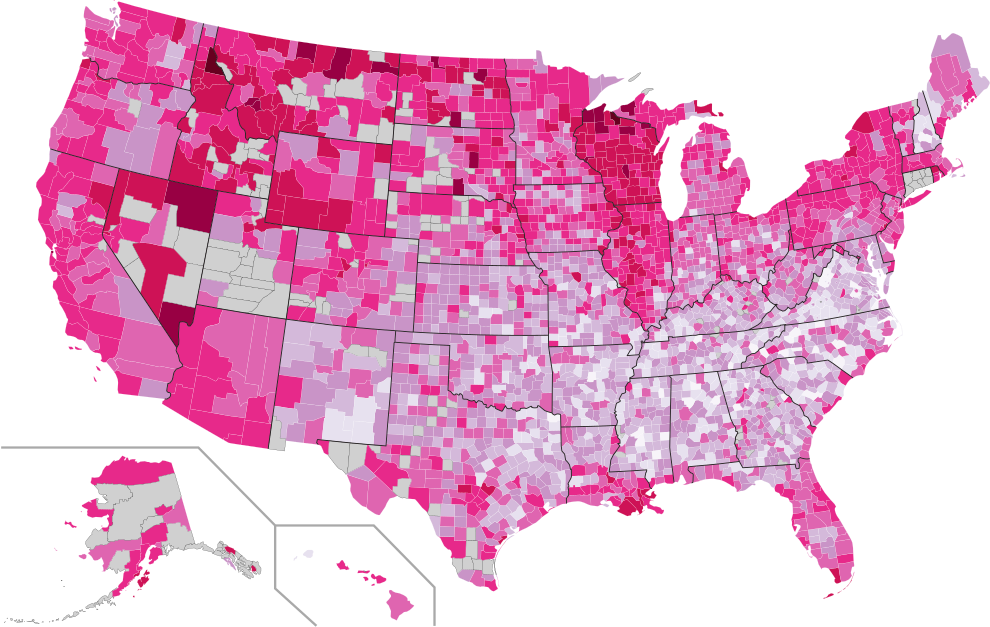

# Econometrics Projects

This directory contains code used to create some of the econometric analyses reported on the Badass Data Science blog. Occasionally source data for these analyses are also stored if the file sizes are small.  

Highlights include:

* [Church-to-Bar Ratio per U.S. County](church_to_bar_ratio)

