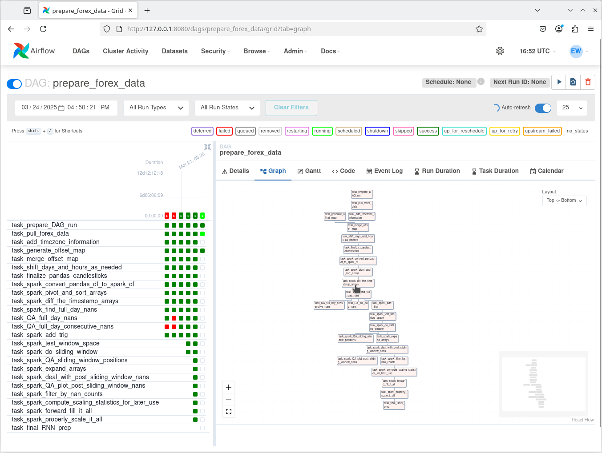

# Pipeline Creation and Management Skill Demo (Apache Airflow)

The code contained herein implements an pipeline that prepares raw currency price data for forecasting using deep learning. Here is a schematic of the pipeline's directed acyclic graph (DAG):

We define DAG elements (tasks) in Python script [prepare_forex_data.py](prepare_forex_data.py) which provides the "command and control" for this pipeline. This file first defines each task, and then specifies the dependencies between tasks. The Airflow server does the rest!

Airflow's user interface shows when tasks fail or succeed during runtime.

